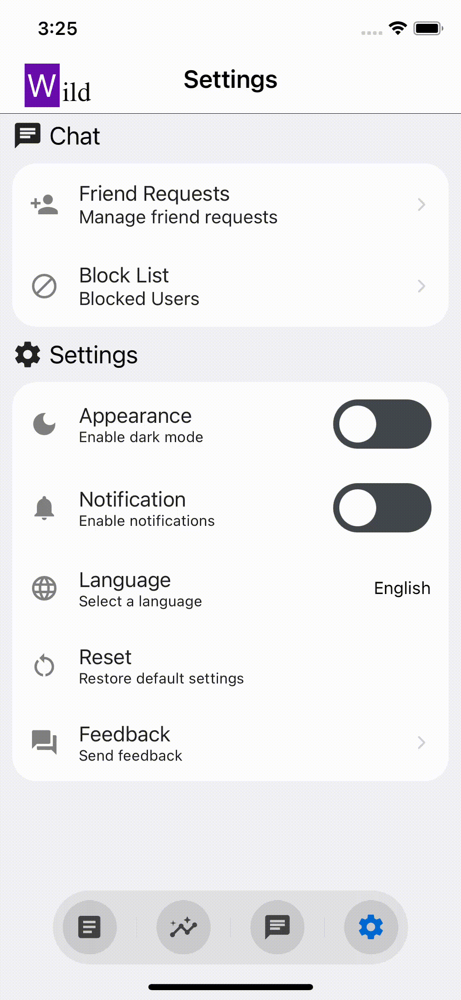

# Wild Wake-Initiated Lucid Dream

 Wild

<h6 align="center">Follow me on</h6>

  &nbsp;
  &nbsp;
  &nbsp;
  &nbsp;
  

> [!WARNING]
> Development is ongoing. Thank you for your patience—I’ll launch the first app by the end of this year!

Dream is kind of Metaverse! Wild is an app designed to enrich your dream experiences. Simply by keeping a dream diary, AI will automatically generate scenes from your dreams. It also analyzes sleep quality and supports lucid dreaming. Share your dreams with other users, chat about them, and explore a world where your dreams come to life.

# ✨　Features

There are several features.

## 💄 Enjoyable UX

| Splash | Hidable Header(Footer) | PvP | DarkMode |
| ------ | ---------------------- | --- | -------- |
|  |  |  |  |
